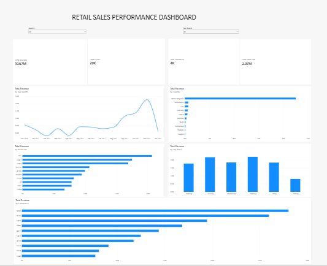

# Retail Sales Performance Analysis

## Project Overview

This project analyzes transactional data from a UK-based online retailer to understand sales performance, product performance, customer behavior, and sales patterns.

The analysis follows a practical workflow using PostgreSQL for data exploration, cleaning, and business analysis, followed by Power BI for data modeling, DAX calculations, and interactive dashboard development.

## Business Problem

The business has approximately one year of transaction data but needs a clearer understanding of its sales performance.

The analysis aims to identify where the business is performing well, where potential problems exist, and where management may need to focus attention.

## Business Questions

1. How much revenue did the business generate, and how did revenue change over time?
2. Which products have the highest and lowest sales volumes?
3. Which countries have the most customers, and how much revenue does each country generate?
4. When do the most sales occur — by month, day of the week, and time of day?
5. Which products generate the most and least revenue?
6. Which customers generate the most revenue?
7. Which customers appear to have become inactive?
8. What products are most frequently purchased by our highest-value customers?

## Dataset

The project uses the Online Retail dataset from the UCI Machine Learning Repository.

The dataset contains 541,909 transaction records from December 2010 to December 2011.

More information about the dataset and its source is available in [`data/README.md`](data/README.md).

## Tools Used

- PostgreSQL — data exploration, cleaning, and analysis
- Power BI — data transformation, modeling, DAX, and dashboard development
- Power Query — data preparation for the Power BI model
- Git & GitHub — version control and project documentation

## Data Preparation

The raw dataset was preserved while analytical filters were applied for normal positive-sales analysis.

The main sales analysis uses:

- `Quantity > 0`
- `UnitPrice > 0`

During data exploration, several issues were investigated, including:

- Cancelled transactions and negative quantities
- Zero-price transactions
- Negative-price accounting adjustments
- Missing customer IDs
- Missing product descriptions
- Exact duplicate-looking transaction records
- Unusual transaction reversals

Exact duplicate-looking records were retained because the available data was not sufficient to determine whether they were data errors or legitimate repeated line items.

Rows with missing CustomerID were retained for overall sales analysis but excluded where an identifiable customer was required.

## Key Findings

- Normal positive sales generated approximately **10.67M** in revenue.
- Revenue increased strongly toward the end of 2011, with **November 2011** generating the highest monthly revenue.
- The **United Kingdom** accounted for the majority of revenue.
- **Thursday and Tuesday** generated the highest revenue among days of the week.
- Revenue was concentrated primarily during daytime hours, particularly between approximately **10:00 and 15:00**.
- StockCode **22423** generated the highest merchandise revenue after known non-product transaction codes were excluded.
- Customer **14646** was the highest-revenue identifiable customer.
- Customer-level analysis identified customers with no positive purchase during the final 90 days of the dataset as potentially inactive for analytical purposes.

## Dashboard

The Power BI dashboard provides an interactive view of:

- Total Revenue
- Total Orders
- Total Customers
- Total Units Sold
- Monthly Revenue Trend
- Revenue by Country
- Top Products by Revenue
- Top Customers by Revenue
- Revenue by Day of Week
- Country and Year-Month filtering

## Analysis Files

The SQL analysis is organized into:

- [`01_data_exploration.sql`](sql/01_data_exploration.sql)
- [`02_data_cleaning.sql`](sql/02_data_cleaning.sql)
- [`03_kpi_analysis.sql`](sql/03_kpi_analysis.sql)
- [`04_customer_analysis.sql`](sql/04_customer_analysis.sql)
- [`05_product_analysis.sql`](sql/05_product_analysis.sql)

## Limitations

- The primary dashboard and performance metrics focus on positive sales rather than net sales after cancellations and reversals.
- Some transactions do not contain a CustomerID, limiting customer-level analysis.
- Historical transaction data cannot confirm that an apparently inactive customer permanently churned.
- Some unusual product transactions and reversals can affect gross positive product metrics.
- Duplicate-looking records were not removed because they could not be confidently classified as errors.

## Project Status

**Completed**

The project includes SQL-based exploration, cleaning and business analysis, an interactive Power BI dashboard, documented findings, and version-controlled project files.s